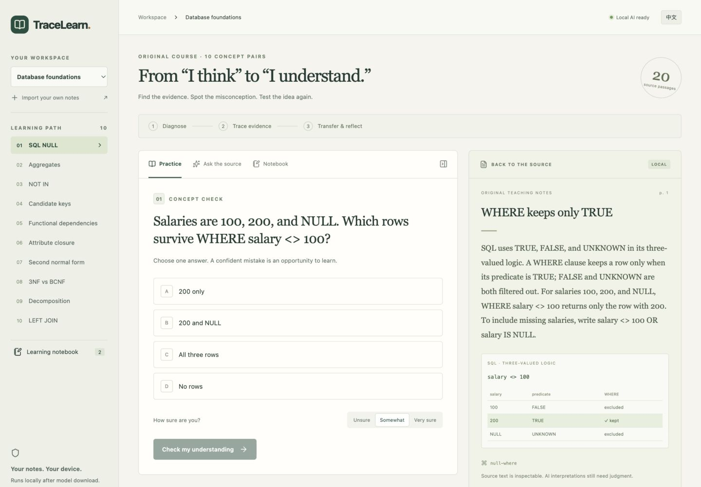

# TraceLearn

**Learning that can show its work.**

[Read the technical report](submission/TraceLearn-Technical-Report.pdf) · [Download the complete package](https://github.com/FENGJIA666/tracelearn/releases/download/v1.0.0/TraceLearn-Complete-v1.0.0.zip) · [Judge walkthrough](JUDGE-GUIDE.md) · [Devpost project](https://devpost.com/software/tracelearn-learning-that-can-show-its-work)



TraceLearn is a local-first learning workspace for university students. It links a concept check to inspectable source passages, targeted misconception feedback, and a transfer question. A local language model can explain the material with checked source quotes, or decline when the source is insufficient.

The worked course covers SQL NULL, aggregates, NOT IN, candidate keys, functional dependencies, closures, 2NF, 3NF/BCNF, decomposition, and LEFT JOIN. It contains 20 original passages and 10 diagnostic/transfer pairs. The course and tests are original contest work; no private student files are included.

## Run

Requirements: Node.js 22.13 or newer, Ollama, approximately 3.2 GB of model downloads, plus dependency storage. Tested on macOS / Apple M4 Pro / 24 GB memory. Windows and Linux were not tested.

1. Install Node.js from https://nodejs.org and Ollama from https://ollama.com/download if absent.
2. In this directory, run `npm run setup` once. It starts a local Ollama process if needed, downloads the two named models, installs locked packages, builds the app, and records/verifies model digests.
3. Run `npm start` and visit http://127.0.0.1:4317.

On the tested Mac, `Start-TraceLearn.command` provides a double-click launcher after setup. It waits for the app before opening the browser. Model files are kept in Ollama's normal model directory and are not bundled in the source ZIP.

No API key, cloud account, paid inference, external font, CDN asset, or user login is required. Initial installation needs internet. Afterwards the app and model processes can operate with outbound network access restricted to localhost. The source and evaluation evidence are public in this repository. The release includes a complete source package and a separately downloadable technical report. The application itself runs locally; there is no hosted inference demo.

## Three-minute walkthrough

1. Choose **SQL NULL** and answer **200 and NULL** with high confidence.
2. Check the feedback, click **null-where**, and inspect why WHERE keeps only TRUE.
3. Open the transfer check and choose **price <> 10 OR price IS NULL**.
4. Use **Explore this reasoning with local AI**, then **Ask the source**. The answer quotes real course passages.
5. Ask what will be on your university exam. The course does not establish this; the model should decline.
6. Open **Notebook** and export the Markdown learning report, including source hash and attempt history.

These demonstration actions are software tests, not evidence of improved student learning.

## Import your own material

PDF with extractable text, UTF-8 Markdown, or UTF-8 TXT. Maximum 10 MB and 50 PDF pages; text is limited to 175,000 characters and assigned virtual page segments. Scanned, mixed scanned, encrypted, damaged, empty, and unsupported files receive explicit errors. OCR is not implemented. Multi-column PDF reading order may need manual checking.

Imported courses support source questions and AI-assisted verbatim cloze practice from the first five passages. The app accepts a question only when the keyed option exactly fills a gap in a verified source quote and the other three options do not reproduce the quoted sentence. These are source-recall exercises, not conceptual transfer tests or independently reviewed questions. Early free-form question generation produced an all-incorrect option set, so the shipped generation path was deliberately narrowed. Built-in exercises stay in English to preserve technical terminology; the interface, built-in source translations, and AI responses support English/Chinese.

## Architecture

```text
React reading workspace
  | same-origin HTTP, localhost only
Node / Express
  |-- SQLite: courses, source hashes, vectors, attempts, question records
  |-- PDF.js / UTF-8 parser: page-aware source passages
  |-- lexical overlap + cosine similarity --> top five passages
  |-- Ollama qwen3-embedding:0.6b --> local vectors
  |-- Ollama qwen3:4b --> structured answer / generated question
  |-- Zod + exact-quote matching + echo/planning rejection
  `-- deterministic exercise grading + Markdown report
```

The rank is 0.75 cosine similarity + 0.25 query-token overlap. This is an inspectable hybrid heuristic, not a trained reranker. For grounded answers the model sees only the top five passages. The comparison baseline sees all 20 passages. Both use the same model, prompt, schema and quote validator. Neither method can prove semantic entailment merely by matching a quote.

`server/ai.ts` defines the frozen model tags and inference parameters. `evaluation/model-manifest.json` records actual model digests and Ollama version. `evaluation/dataset-lock.json` fixes the 80-case dataset. The pilot and its observed defects are retained separately from the final run.

## Validation and reproducibility

- `npm test`: content, SQL execution, closure derivation, imports, malformed outputs, aborts, timeout/unavailable behavior, and exact-quote rejection.
- `npx tsx scripts/http-check.ts`: isolated SQLite database and local server; validates user routes, hidden answers, input checks, origin restrictions, history and export.
- `npm run build`: TypeScript and production build.
- `npm run evaluate`: runs missing evaluations and regenerates summary. Existing results are not overwritten. To independently rerun, copy the code to a fresh directory and archive `evaluation/raw-results.jsonl` first.
- `evaluation/raw-results.jsonl`: accepted final model output, retrieved sources, timings and available retry records; rejected calls retain error records.
- `evaluation/semantic-review.json`: agent-assisted review, explicitly not an independent human study.
- `submission/TraceLearn-Technical-Report.pdf`: self-contained explanation and measured results.

To reproduce the final measurements, use the recorded model digests and configuration. Inference timing depends on hardware, warm state and other workload. This small, author-created benchmark is not a general measure of educational effectiveness.

## Data and safety boundaries

All course files and session records live in `.local/tracelearn.sqlite` by default. Neither source ZIP nor submission media contain that database. The server listens on 127.0.0.1 only and rejects unexpected Host and Origin headers. This is a single-user local application; no multi-user authentication is implemented. Do not expose this server or Ollama through a public tunnel.

React renders model and document content as text. Documents cannot run application code. Instructions embedded in source text are treated as untrusted; prompt-injection resistance is tested on representative cases, not guaranteed against all attacks. Cancellation aborts the model request and prevents a partial answer from being saved; HTTP success immediately before cancellation may already have been persisted.

## Troubleshooting

- **Local AI unavailable**: start Ollama, run `npm run setup`, then **Check connection**.
- **Model missing**: `ollama pull qwen3:4b` and `ollama pull qwen3-embedding:0.6b`.
- **Slow first request**: first indexing and model loading take longer; subsequent requests reuse local vectors and model memory.
- **Unverifiable response**: the model failed output checks twice. Ask a narrower question; the failed answer is not accepted.
- **Import rejected**: export the source as a text PDF or UTF-8 notes; scanned files need OCR outside this app.
- **Port in use**: the launcher reuses an existing TraceLearn instance. With the CLI use `PORT=4321 npm start`.

## AI contribution and limitations

Codex assisted with concept design, implementation, original course and question drafting, test design, visual composition and documentation. Qwen generates runtime responses. Deterministic tests and agent-assisted content checks were used; no independent classroom study, real-user adoption claim or measured learning gain is asserted. The competition encourages AI projects; explicit organizer approval of this development workflow has not been obtained. See `submission/AI-DISCLOSURE.md` and `THIRD-PARTY-NOTICES.md`.

## Report regeneration

The finished PDF and all six screenshots are already included. To regenerate the report on a machine with Python 3.11+, install `scripts/requirements-report.txt` in a virtual environment, then run `python scripts/make-report.py` after the complete 160-request summary exists. The script uses the included actual screenshots and saved review judgments; it does not create new evaluation evidence. `python scripts/write-review.py` only recounts the saved agent-assisted judgments. `submission/architecture.svg` is a standalone vector architecture diagram.

The final answering pipeline is byte-identical to the evaluated v3 pipeline. Imported-source practice was subsequently narrowed to source-derived cloze answers and model-proposed distractors; `evaluation/answer-pipeline-preservation.json` records that boundary and the frozen benchmark source is retained.
